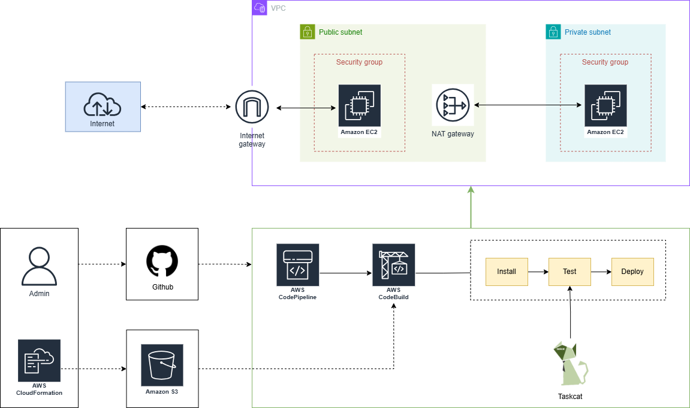

# Automating Infrastructure as Code using CloudFormation and CodePipeline

## Targets:

1. Use CloudFormation to deploy AWS services (as described below).
2. Utilize AWS CodeBuild with cfn-lint and Taskcat to validate the correctness of CloudFormation templates.
3. Use AWS CodePipeline to automate the build and deployment process from source code.

### AWS services to deploy:
#### VPC:
- **Subnets**: Include both a Public Subnet (connected to the Internet Gateway) and a Private Subnet (using a NAT Gateway for outbound connections).
- **Internet Gateway**: Attach to the Public Subnet to allow resources inside the subnet to access the Internet.
- **Default Security Group**: Create a default Security Group for the VPC.

#### Route Tables:
- **Public Route Table**: Route Internet traffic through the Internet Gateway.
- **Private Route Table**: Route Internet traffic through the NAT Gateway.

#### NAT Gateway: 
- Enable resources in the Private Subnet to connect to the Internet while maintaining security.

#### EC2 Instances: 
- Deploy instances in both Public and Private Subnets:
  - The Public instance must be accessible from the Internet.
  - The Private instance must only be accessible from the Public instance via SSH.

#### Security Groups:
- **Public EC2 Security Group**: Allow SSH (port 22) connections only from a specific IP.
- **Private EC2 Security Group**: Allow connections from the Public EC2 instance on necessary ports.

## Architecture:

