# Guideline
1. Create bucket then upload [cfn_nested_templates](./infras/aws/cfn_nested_templates/)
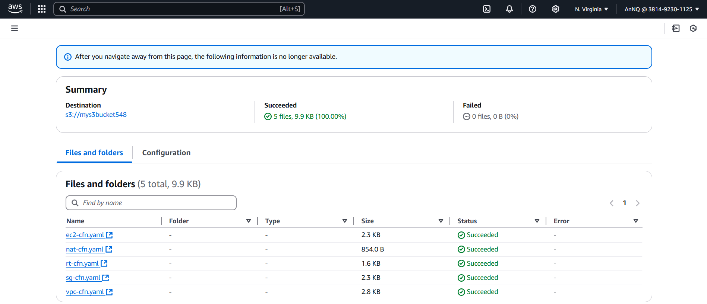
2. Use **Deploy to CloudFormation** template
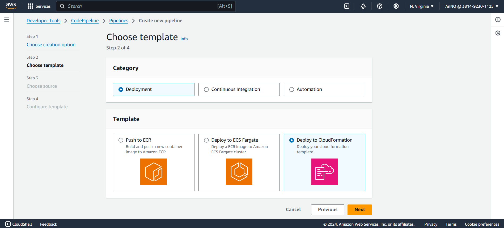
3. Use CodeConnection **Connect to Github**
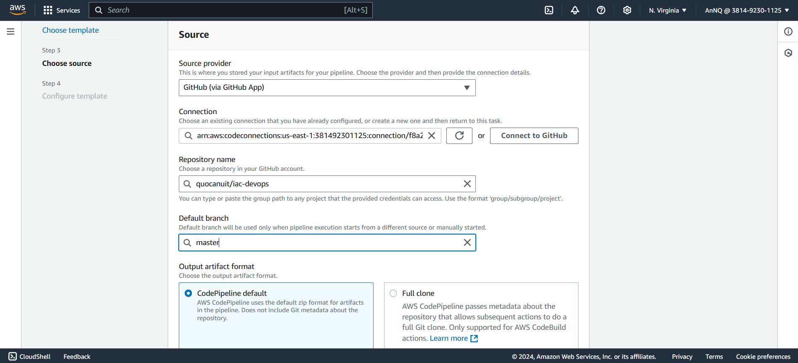
4. A CloudFormation Starter Template will be deployed
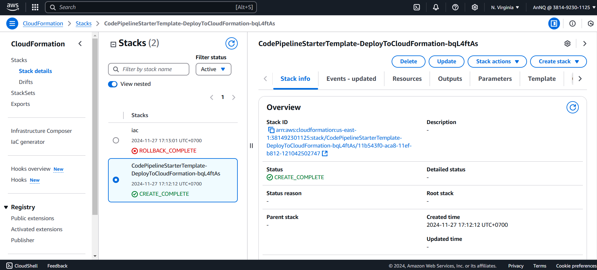
5. Edit the Pipeline, add new stage for CodeBuild
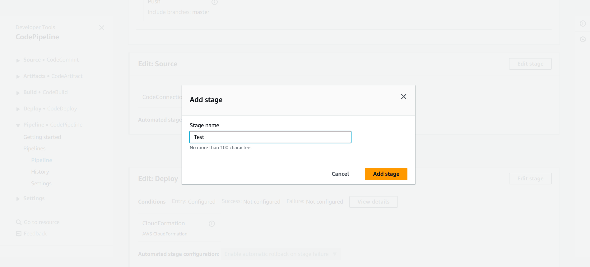
6. Hit **Create project**
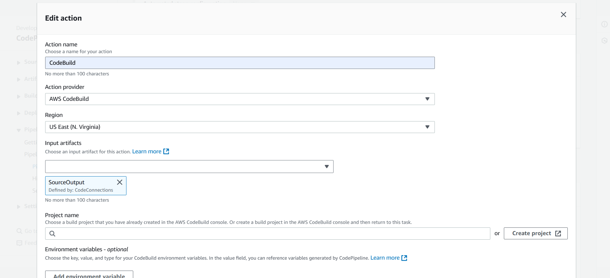
7. **Use a buildspec file**. Leave other options as default.
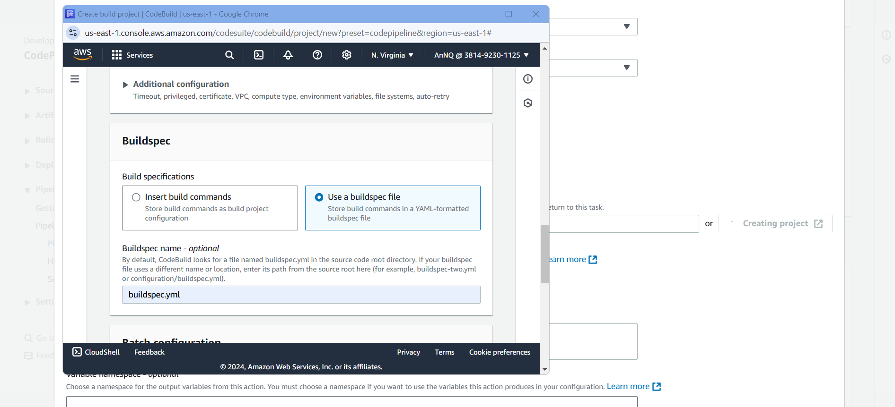
8. Done
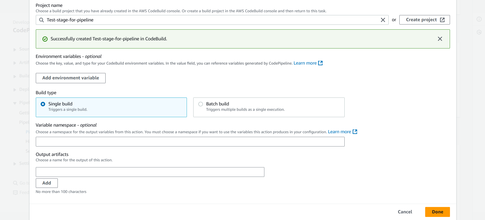
9. In **Edit: Triggers**, make sure it got a branch in "Include branches"
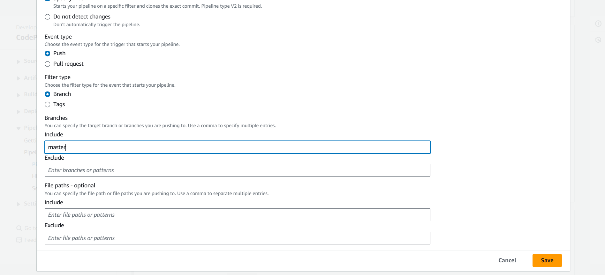
10. Modify **buildspec.yml** bucket name
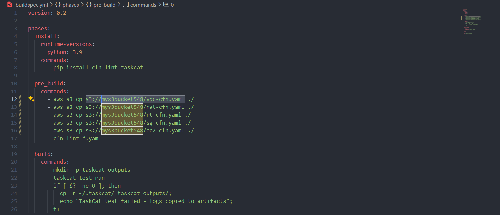
11. Modify **.taskcat.yml** TemplateBucketName and KeyName
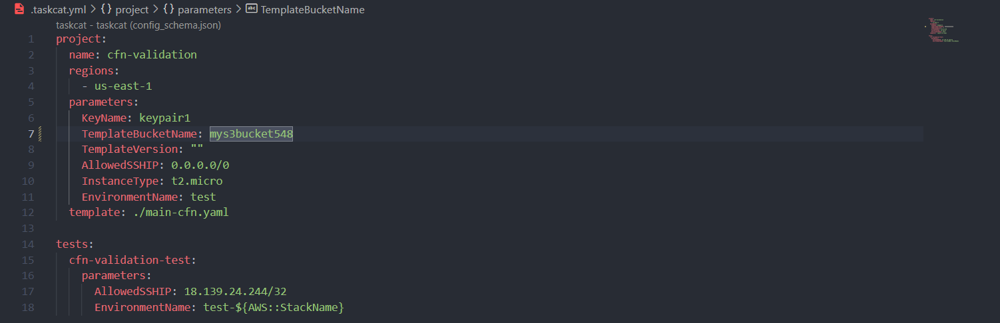
12. Modify **main-cfn.yaml** TemplateBucketName and KeyName (and other parameters if needed)
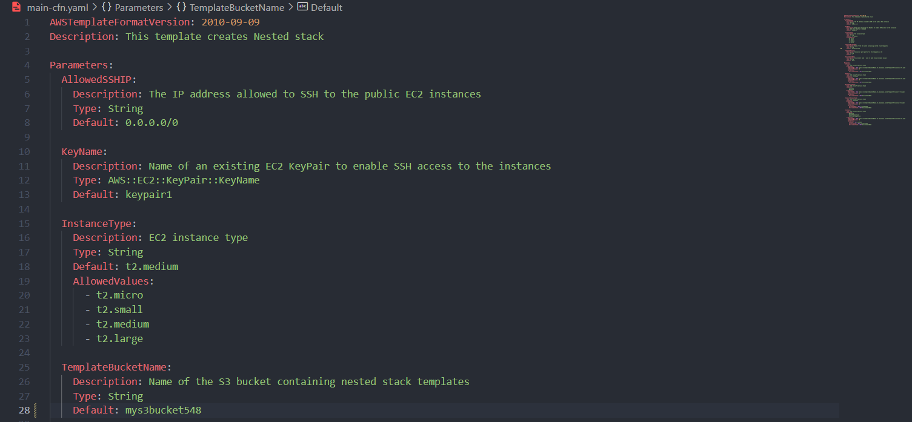
13. Commit changes
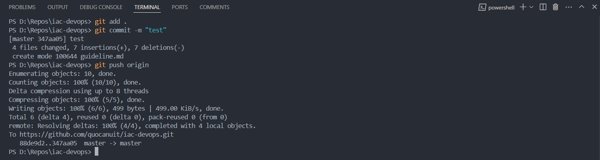
14. Then the pipeline will automatically be triggered, then got some permission errors. To resolve them, create new inline policy for your CodePipeline service role. ([cp_inline_policy](./infras/aws/code_pipeline/cp_inline_policy.json))
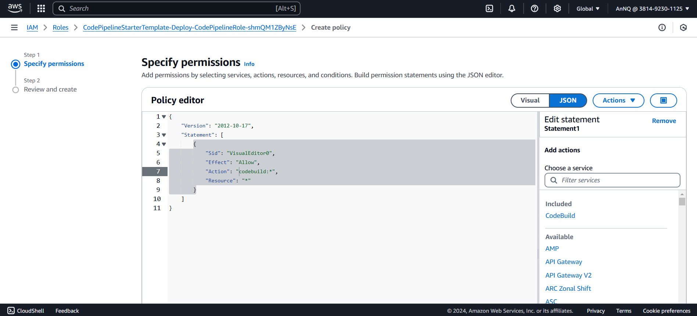
15. Also create new inline policy for CodeBuild service role. ([cb_inline_policy](./infras/aws/code_build/cb_inline_policy.json))
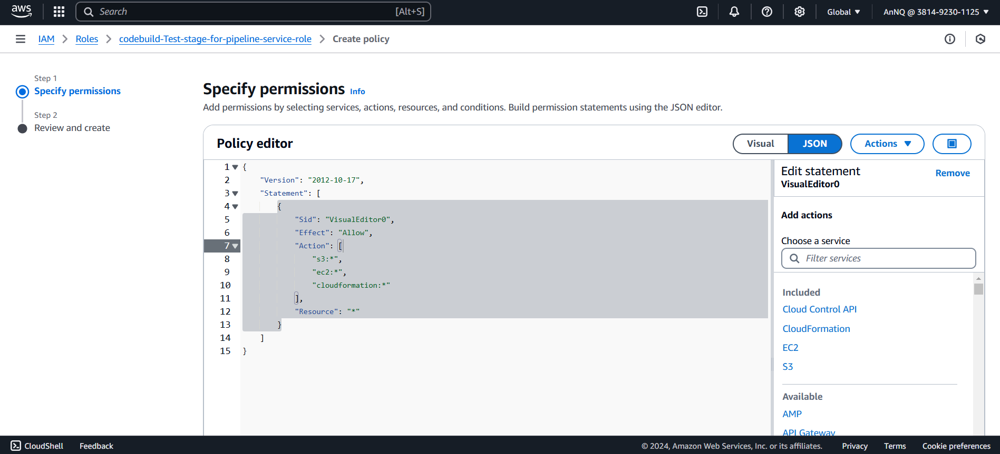
16. Retry stage and it should run successfully.
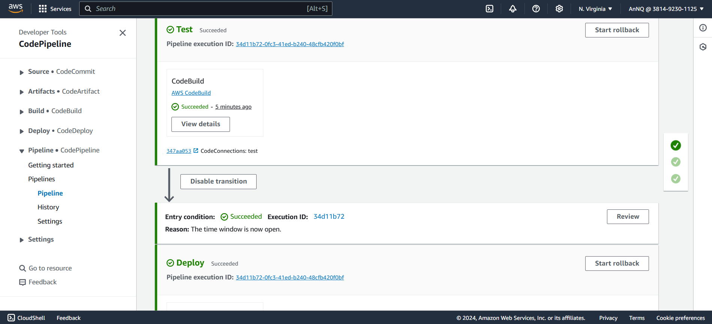